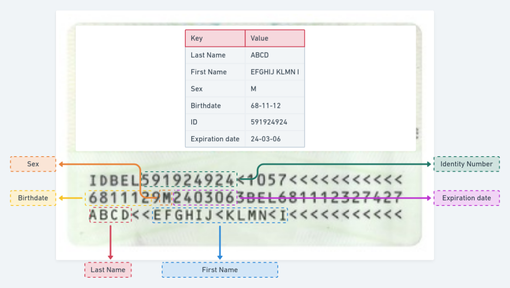
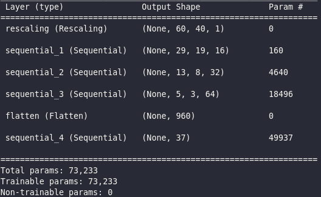
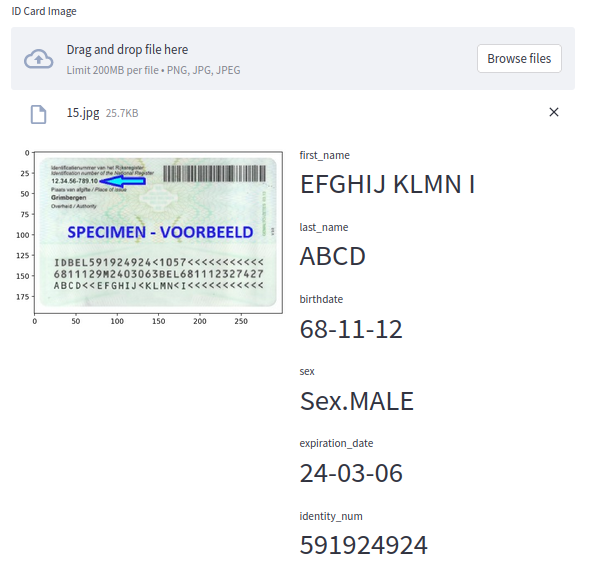

# Personal Information Extraction from ID Cards
This project is a computer vision system that can detect and localize region text, also called **machine-readable zone (MRZ)** in a scan of an ID card. Then, the goal is to extract the personal informations such as the ID card holder's name, ID number, date of birth, sex and expiration data. 

This project involves using MRZ of [type 1](https://en.wikipedia.org/wiki/ISO/IEC_7810), corresponding to the ISO/IEC 7810 sizes, with **3 lines $\times$ 30 characters**.  This is an example of a Belguim ID card found in the internet. 

This repo includes:
* Implement the image processing steps to detect the region of interest from a scan of an ID card
* Split the ROI horizontally and vertically to get small images of characters
* Build the processed dataset from raw images
* Train and tune a basic CNN model to classify grayscale images
* Implement the pipeline to get personal informations from a signle scan
* Deploy the trained model using FastAPI and Docker/Docker-compose
* Streamlit App to showcase the system

# How to run
* Clone this repo
* Install [poetry](https://python-poetry.org/docs/) (a tool for dependency management and packaging in Python built on top of pip)

      curl -sSL https://raw.githubusercontent.com/python-poetry/poetry/master/get-poetry.py | python -
* Install the dependecies && activate the virtual environment

      poetry install && poetry shell
* Preprocessing steps to build the unlabeled data

        python src/data/process.py -i "input_data_path" -o "output_data_path"
* Label your characters images into *37* classes 
    * Numbers (10 classes): 0 - 9
    * Letters (26 classes): A - Z
    * Separator (1 class): <
* Split your data into training, validation and test

        python src/features/split.py
* Hyperparameters Optimization (HPO) using TensorBoard:

        python src/models/tune.py
* Train the model with the best hyperparameters set:

        python src/models/train.py

* Evaluate the trained model 

        python src/models/evaluate.py

* Save the trained model in the SaveModel format of TensorFlow

        python src/models/save.py

* Use the model to inference on a single image using CLI

        python src/models/predict.py --input_image "image_path"

# Data
Data was gathered from the internet as well as my friends's ID cards. In total, I collected about **300** images with different resolutions and positions of the ID card in the scan. 

# Modeling
**TensorFlow** was used to build a simple CNN model with **three** convolutional blocks and  **two** fully connected layers including the softmax layer. 

# Streamlit App
* You can run the app locally:

        streamlit run src/streamlit/app.py

# Deployment using FastAPI and Docker
We deploy the model as an HTTP endpoint using FastAPI, and then dockerize the code in a docker image.
* To build the image:

      docker image build -t id_cards_model .
* To run the container locally:

      docker container run -d -p 8080:80 --name myapp id_cards_model
*To run the app using docker-compose:

      docker-compose up 
* To run the app using docker swarm:

      docker stack deploy -c docker-compose.yml MyApp
